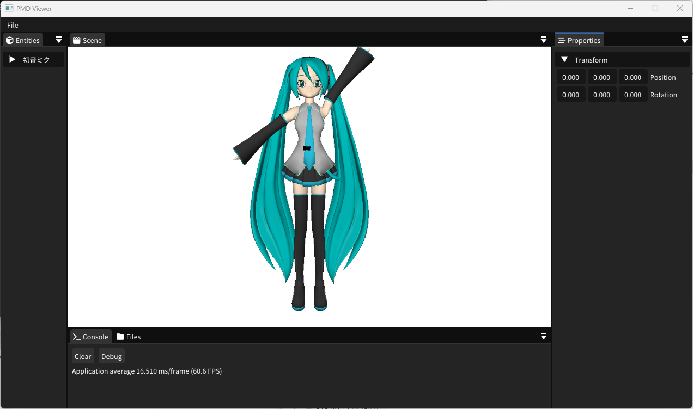
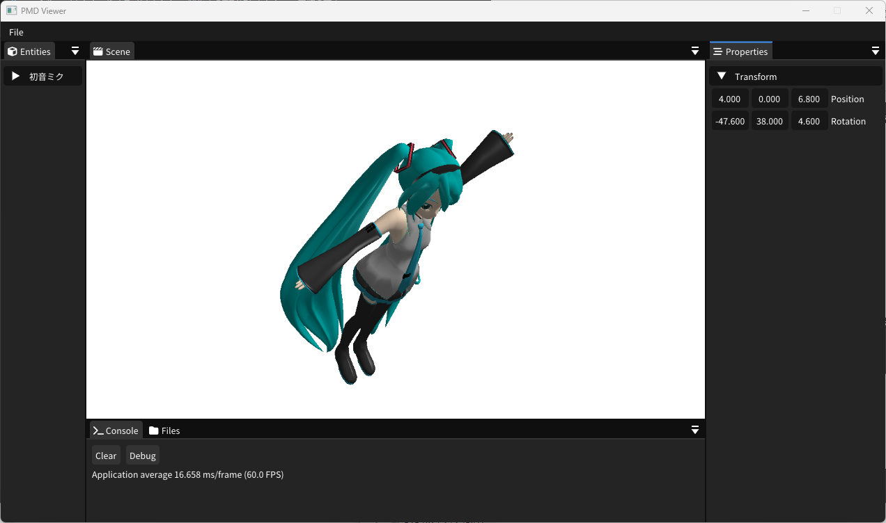
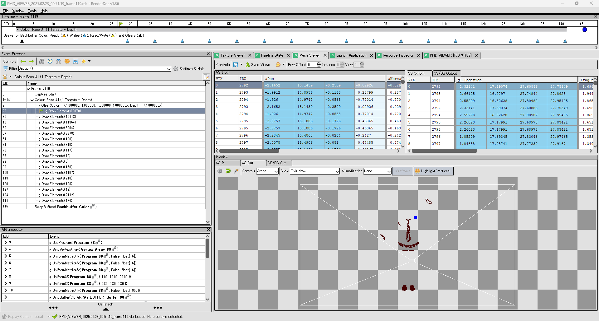

<!-- markdown-enhance -->

# ポートフォリオ

## **自己紹介**

### **基本情報**
- **名前**: 石川裕也  
- **メールアドレス**: yuuya.ishikawa@gmail.com  
- **GitHub**: [github.com/NANOBANA-SUB](https://github.com/NANOBANA-SUB)  

### **プロフィール**
ソフトウェアエンジニア / 大学生として、**Linux カーネル、システムソフトウェア、ゲームエンジン開発** などを専門に研究・開発を行っています。  
特に **Linux のページキャッシュ管理** に関する研究を進めており、カーネルレベルでの I/O 最適化や独自のキャッシュアルゴリズムの実装に取り組んでいます。  

また、**カーネルモジュール開発** を通じて、低レイヤのシステム設計やデバッグ技術を習得。  
パフォーマンスチューニングやトレースツール (ftrace / perf / Kprobe) を活用した解析も行っています。  

さらに、**ゲームエンジン開発** にも関心があり、**OpenGL / SDL を用いたレンダリングエンジンの開発** や、  
**ImGui を用いたエディタ UI の設計** などを行っています。  

## 保有技術と使用期間
### **C言語**
- **使用期間:** 約5年
- **使用用途**: ツール制作やシステム開発に幅広く活用。最近ではLinuxカーネルを対象とした開発に注力し、特にカーネルモジュールの開発を頻繁に行っています。

### **C++言語**
- **使用期間**:約4年
- **使用用途**:ツール制作、ゲーム開発に幅広く活用。ゲーム開発ではOpenSiv3Dをよく使用しています。最近は自作ゲームエンジン開発に向けて、3DCG及びGUIの開発にも用いています。

### **C#言語**
- **使用期間**:約2年
- **使用用途**:ツール制作、ゲーム開発に活用。ツール制作では.NETを用いたGUIアプリ等の開発経験があります。ゲーム開発ではUnityを用いていました。過去にインディーズゲームを制作している会社でVFX及び、ゲームシステム部分の開発に使っておりました。

### **Python**
- **使用期間**:約1年
- **使用用途**:アルバイト及びインターンで用いております。開発実績としましては、scikit-learnを用いた機械学習による退職率測定ソフト、seleniumを用いた業務システムの開発があります。

### **使用経験のあるライブラリ・フレームワーク**

#### **GUI 関連**
- **SDL / ImGui / Qt / .NET Framework**  
  - SDL によるウィンドウ管理・イベント処理  
  - ImGui を用いたリアルタイム UI の実装  
  - Qt による GUI アプリケーション開発  
  - .NET Framework を用いた Windows アプリ開発  

#### **グラフィックス / レンダリング**
- **OpenGL / GLEW / glm / stb**
  - OpenGL と GLEW を活用した 2D・3D レンダリング
  - glm を用いた行列・ベクトル演算
  - stb 画像ライブラリを活用したテクスチャ処理
  - Vulkan を用いた低レイヤーグラフィックス API の学習  

#### **データ処理 / 数値計算**
- **pandas / numpy / matplotlib**
  - pandas を用いたデータ解析・前処理
  - numpy による高速な数値演算
  - matplotlib によるデータ可視化  

#### **機械学習**
- **scikit-learn**
  - scikit-learn を用いた教師あり学習・特徴量選定・モデル評価  

#### **ゲームエンジン**
- **OpenSiv3D / Unity**
  - OpenSiv3D を活用したゲーム開発
  - Unity による 2D / 3D ゲーム開発  

#### **ロギング**
- **spdlog / Quill**
  - spdlog を用いた軽量・高速なロギングシステム構築
  - Quill による非同期ロギングの導入  

#### **その他**
- **Selenium**: Web 操作の自動化  
- **Linux Kernel API**: カーネルモジュール開発・デバッグ（ftrace / perf / Kprobe など）  
- **CMake / Git / Jenkins**: ビルドシステム・バージョン管理・CI/CD  

### **使用経験のあるバージョン管理システム**
- **git**:使用期間3年ほど
- **subversion**:使用期間半年ほど
## 制作中のプロダクト
### **PMDモデル描画アプリ**
- **リポジトリ**:[PMDViewer](https://github.com/NANOBANA-SUB/pmd_viewer)
- **使用技術**: C++, OpenGL
- **使用フレームワーク及びライブラリ**:glew, glm, stb, SDL, ImGui, spdlog
- **特徴**: 既存ゲームエンジンに似たUIで操作が可能
- **開発期間**:2ヵ月
### **開発経緯**
Unityライクな3Dゲームエンジンの開発を進めていた際、自身の3DCGに関する基礎知識の不足に気づき、モデルデータのレンダリング処理をフルスクラッチで実装するアプリを制作することに決めました。

昔から親しんでいるMMD（MikuMikuDance）のモデルを題材に選び、データ構造の理解から学び直すことで、ゲームエンジン開発の基盤とすることを目指しています。

### **開発コンセプト**
本プロダクトでは、マルチプラットフォーム対応 と 既存のゲームエンジンに似た UI をコンセプトに開発を進めました。

既存の MMD Viewer や Editor は Windows 向けのものが多く、さまざまな環境で動作するツールが欲しかったこと、そして本プロダクトをさらに発展させて ゲームエンジンの開発につなげたい という意図がありました。

このコンセプトを満たすために、以下のライブラリを採用しました。

- **OpenGL（グラフィックス）**
- **SDL（マルチメディア）**
- **ImGui（GUI）**
  
これらのライブラリは、歴史が長く、サポートが継続されている ことに加え、インターネット上に豊富な情報があるため、採用を決めました。
### **実際の画面**

制作中のGUIになります。

開発コンセプトの通り、表示した3Dモデルをゲームエンジンの要領で操作することができます。

また、それぞれのタブはドッキングができるようになっており、自分の使いやすい配置にすることもできます。

こちらはMacOS(AppleSilicon)で動作させている様子になります。
別のOSやプロセッサでも同じ動作で扱えるようになっております。

### **開発における工夫点**

- **バッファ管理の設計と安全性の向上**
本プロダクトでは、各種バッファを扱いやすいクラスとして提供し、可読性の向上を意識しました。
バッファ関連のインターフェースは 統一性を持たせる ことで、異なる種類のバッファを扱う際にも直感的に使用できるよう工夫しています。
また、OpenGL は共有リソースを扱うため、コピーコンストラクタを利用すると意図しないバグの原因となる可能性 があります。
そのため、コピーを禁止し、ムーブセマンティクスを活用して所有権を適切に管理する設計を採用しました。
これにより、リソースの二重解放や不要なデータコピーを防ぎ、安全性とパフォーマンスの向上を図っています。

- **エラーロギングの導入によるデバッグ効率の向上**
さらに、ロギングライブラリを導入 し、実行時のエラーメッセージや警告を記録できるようにしました。
これにより、プログラムがクラッシュした際や異常動作が発生した際に、詳細なログを確認することで原因を素早く特定 できます。
特にOpenGLのAPI呼び出しにおいてはエラーチェックが重要であるため、エラーメッセージを即座にログへ記録し、デバッグを容易にする仕組みを整えました。
今後は、ログの出力をより詳細にカスタマイズできるようにし、開発時とリリース時でログレベルを動的に変更できる設計も検討したいと考えています。
### **開発で苦労したこと**
- **PMDデータのデータ構造とその扱い**
PMDモデルはフリーのモデル形式ですが、こちらの仕様を読みながら実装するのが大変でした。特に、各種構造体の歯切れが悪く、アライメントが発生する問題，文字コードにShift-JISを用いているためモデル名などの文字データが扱いにくい問題には非常に苦労しました。
仕様を読みながら実装を進めるのは大学の研究活動を通じて身に着けていたので、この経験が活きたと感じております。
- **グラフィックスのデバッグ**
制作を進める中で、シェーダのレンダリング結果をデバッグする場面が多くありました。しかし、シェーダはCPU上で動作するプログラムではないため、従来のデバッガでブレークポイントを設定してステップ実行することができず、デバッグに苦労しました。
そこで、グラフィックスデバッガである RenderDocを使用しました。このツールを活用することで、GPUに送られるデータを可視化できるため、意図した値と異なる場合に素早く問題を特定できます。
特にOpenGLのAPIでは、int型とfloat型で異なる関数を使用する必要があるため、誤った API を呼び出してもすぐに気づけないことがあります。しかし、RenderDocを用いることで、こうしたミスを早期に発見でき、大いに助けられました。

### **今後の課題**
現在の実装にはハードコーディングが多く、柔軟性に欠ける状態です。
特に モデルのロード処理がハードコーディングされている点が大きな問題であり、改善が必要だと考えています。

また、将来的にさまざまなモデルをロードできるようにするため、各モデル専用のクラスを作成する前に、共通のインターフェースを設計したいと考えています。
## 過去のアルバイト(インターン)経験
今まで経験した中から一部を抜粋して紹介します。
## 機械学習を用いた業務アプリケーションの開発インターン
- **勤務期間:2022年8月～2022年9月**
- **使用技術:Python，scikit-learn，git**
- **ポジション:ソフトウェアエンジニア，リードエンジニア，グループリーダー**
- **経験した業務:要件定義，詳細設計，実装，テスト**

### **概要**
新卒社員の3年以内の退職率を推定する、人事向け業務アプリケーションを開発しました。
即席の4人チームでリーダーを務め、設計・実装・テストを統括。Pythonとscikit-learnを用いて退職リスクを分析する機械学習モデルを実装し、特徴量選定やハイパーパラメータ調整を行いました。

また、Gitを用いたバージョン管理とコードレビューを導入し、短期間で一定の精度を持つモデルを構築。
この経験を通じて、開発進行管理、機械学習の実装、チーム開発のノウハウを習得しました。

### **開発内容と貢献**

採用向け性格診断ツール **「Qubic」** の結果をもとに、新卒社員の **3 年以内の退職率を推定するソフトウェア** を開発しました。  
Qubic には多数のパラメータが存在し、**どの要素が退職と相関があるのかを数学的に解析することは困難** でした。  
そこで、**機械学習を活用し、データから自動的に特徴量を抽出するアプローチ** を採用しました。

### **開発環境とチームマネジメント**

開発期間は約 **3 週間** で、**Python をはじめ、初めて扱うツールを用いた開発** だったため、短期間でのキャッチアップが求められました。  
また、**初めてのチーム開発** だったため、円滑なコミュニケーションを意識し、**進捗確認や問題の共有を積極的に行う環境づくり** に努めました。  

特に、**毎日ランチを共にしながら課題を話し合い、技術的な議論だけでなく、チームメンバーのメンタルケアにも配慮** しました。  
その結果、**メンバーとの強い信頼関係を築くことができ、インターン終了後も交流が続いています。**  

### **成果と学び**

プロジェクトとしては、**全グループの中で最も高い予測精度を達成** しました。  
しかし、最優秀賞には至らず、その主な要因は **クライアント側の使用感が想定と合わなかったこと** でした。  

この経験を通じて、**開発における要件定義の重要性を実感** し、技術力だけでなく **ユーザーのニーズを的確に捉えるスキルの必要性** を学びました。

## Seleniumを用いた業務アプリケーションの開発アルバイト
- **勤務期間:2024年9月～**
- **使用技術:Python，Tkinter，subversion**
- **ポジション:ソフトウェアエンジニア，リードエンジニア**
- **経験した業務:要件定義，詳細設計，実装，テスト**
  
### **概要**
特許事務所における、各種申請手続きの自動化を目的とした業務アプリケーションを開発 しています。Selenium を活用し、申請プロセスの効率化とヒューマンエラーの削減 を実現するツールを構築中です。

開発チームは3人体制で進めており、リードエンジニアとして要件整理、設計、実装を主導。
これまでの経験を活かし、技術選定や開発方針の決定にも関与しながら、プロジェクトを推進しています。

また、Tkinter を用いたGUIの実装 にも携わり、ユーザビリティを考慮したデザインを設計。
バージョン管理にはSubversionを導入し、コードの品質管理やチーム間の開発フローを統率しています。

### **開発内容と貢献**

特許事務所で利用される **Web ツールの業務自動化を目的としたアプリケーション** を開発しています。  
本プロジェクトでは、**これまでの開発経験を活かし、クライアントとの綿密な仕様策定に注力**。  
ユーザーの抽象的な要望を具体的な機能として提案し、スムーズな開発を実現しています。

### **役割と開発体制**
現在の事務所には **複数人での開発経験を持つエンジニアが不在** であるため、  
**リードエンジニアとしてチームを統率し、開発体制を整備** しています。

- **タスク管理:** Redmine を導入し、チケット単位で実装・バグ修正を進めるフローを確立  
- **バージョン管理:** Subversion を使用し、開発履歴の管理を徹底  

### **開発環境の整備**
**Redmine の導入に伴い、所内 Wiki を積極的に整備。**  
ドメイン特有の用語、開発ルール、ライブラリのリファレンスなどを体系的に記述し、  
新しいメンバーでもスムーズに開発に参加できる環境を構築しました。

### **成果と貢献**
このプロジェクトを通じて、**これまで事務所内の限られた人しか対応できなかった作業をすべて自動化** し、  
業務の効率化に大きく貢献しました。
## 大学での研究について
### **研究内容**

Linux の **ページキャッシュアルゴリズムを改善し、ディスク I/O の性能向上を図る研究** を進めています。  
現在の Linux カーネルでは、ページキャッシュの置換アルゴリズムとして **LRU (Least Recently Used)** を採用していますが、  
**二重キャッシュ環境やシーケンシャルアクセス時にキャッシュヒット率が大幅に低下する** という課題があります。  

そこで、**独自のキャッシュアルゴリズムをカーネルに実装** し、これらの課題を解決することで **ディスク I/O の最適化** を目指しています。

### **研究で苦労していること**

Linux カーネルの **コード解析、デバッグ、およびカーネルモジュールの開発** に苦労しています。  
現在の Linux カーネルは **約 3,000 万行のソースコード** で構成されており、その全容を把握するのは現実的ではありません。  
そのため、**自分が知りたい実装を大規模なコードベースの中から探し出す作業** に大きな労力を要しています。  

実際の解析では、**ftrace や perf** などのカーネルトレースツールを活用し、コールスタックの解析を行いながら、  
**カーネル内部の挙動を地道に追跡** しています。  
また、ソースコードを読むだけでは全体像を理解するのが難しいため、**「Linux カーネル 2.6 解読室」などの専門書を活用し、  
カーネル設計の基本や Linux における設計思想を学びながら、体系的なコードリーディング** に取り組んでいます。  

さらに、**研究の一環としてカーネルモジュールの開発も行っており、  
独自のキャッシュアルゴリズムの実装や I/O トレースの取得を通じて、カーネルの動作を詳細に分析** しています。  
カーネルモジュールの開発では、**カーネル API の理解に加え、メモリ管理や競合制御といった低レベルの設計も求められるため、  
バグの原因を特定するのが非常に困難** です。特に、カーネルデバッグ環境の構築には試行錯誤を重ね、  
**カーネルログの解析や Kprobe を用いたデバッグ手法を習得** しました。  

この研究活動を通じて、**大規模なコードを解析する力、カーネルレベルでのシステム理解、  
動作しないシステムを根気強く調査するスキル、そして問題に粘り強く取り組む精神的なタフネス** を身につけました。
